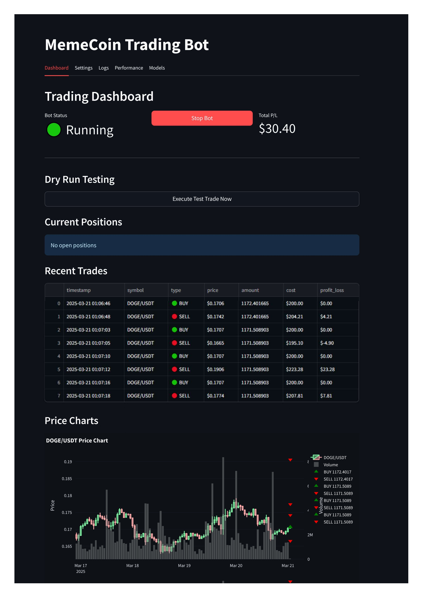
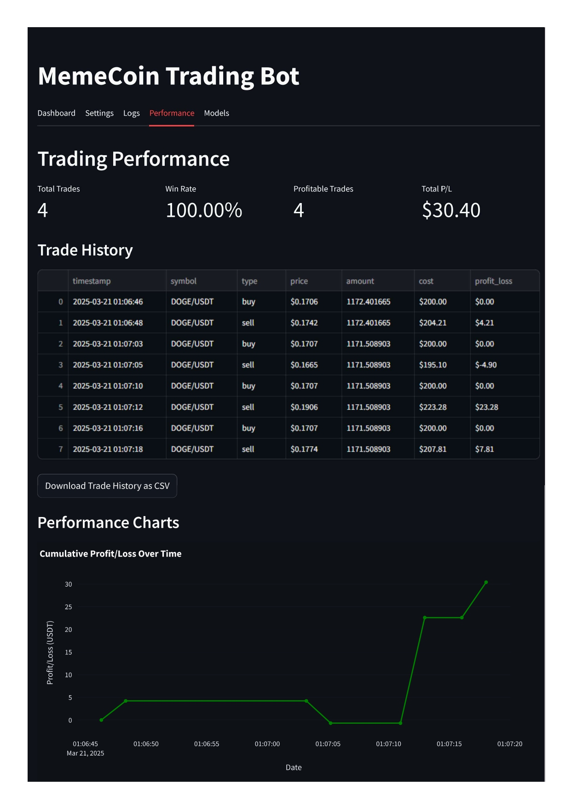

# MemeCoin Trading Bot 📈

An automated trading bot built with Streamlit for trading popular memecoins on KuCoin exchange. The bot uses machine learning to predict price movements and execute trades in real-time.



## Features

- 🤖 Automated trading using machine learning predictions
- 📊 Real-time price charts and trade monitoring
- 💰 Support for multiple memecoin pairs (DOGE, SHIB, PEPE, FLOKI, etc.)
- 🔄 Automatic model retraining to adapt to market conditions
- 📈 Performance tracking and trade history
- 🧪 Dry run mode for testing strategies without real funds

## Dashboard Overview


## Getting Started

1. Configure your KuCoin API credentials in the Settings tab:
   - API Key
   - API Secret
   - API Passphrase

2. Select your trading preferences:
   - Choose trading pairs
   - Set timeframe (1m to 1d)
   - Configure risk parameters
   - Enable/disable dry run mode

3. Click "Start Bot" to begin trading

## Trading Settings

- Initial Balance: Set your starting balance
- Risk per Trade: Percentage of balance to risk (1-10%)
- Stop Loss: Automatic stop loss percentage (1-20%)
- Take Profit: Profit target percentage (2-50%)

## Monitoring

- Dashboard: View current positions and recent trades
- Performance: Track profit/loss and win rate
- Logs: Monitor bot activities and errors
- Models: View model metrics and retrain as needed

## Safety Features

- Dry Run Mode for testing
- Automatic stop loss
- Risk management per trade
- Real-time error monitoring

## Tech Stack

- Streamlit: Web interface
- Python: Core trading logic
- Scikit-learn: Machine learning models
- KuCoin API: Exchange integration
- Plotly: Interactive charts

## Important Notes

- Always start with Dry Run mode to test strategies
- Monitor the bot regularly
- Past performance does not guarantee future results
- Use at your own risk

## Running the Bot

The bot runs on port 5000 by default. Access the dashboard at:
```
https://your-repl-name.replit.app
```

## License

MIT License - Use at your own risk

## Disclaimer

This bot is for educational purposes only. Cryptocurrency trading carries significant risks. Always do your own research and never trade with money you cannot afford to lose.